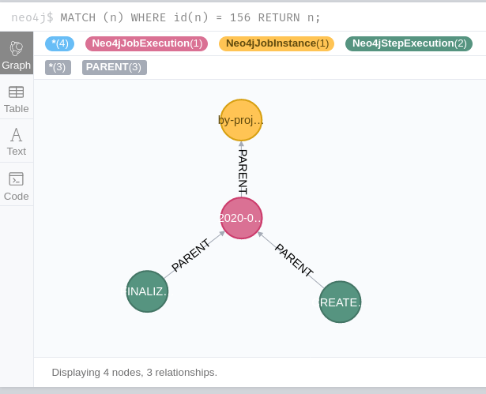

[](https://codecov.io/gh/valb3r/springbatch-neo4j-adapter)

# Description

Provides Spring-batch **JobRepository** and related metadata persistence in Neo4J.

# Purpose

Currently, the support of NoSQL databases in Spring-Batch is limited to ItemReader/ItemWriter for Neo4j and Mongo.
This means that to persist state of Spring-Batch job you would need to have an RDMBS database even if you don't need it as there is no `JobRepository` persistence adapter available.
See these open tickets:

 - https://github.com/spring-projects/spring-batch/issues/877
 - https://github.com/spring-projects/spring-batch/issues/1988

This project aims to solve this problem for Neo4j. It offers ready to use Spring Batch metadata persistence adapter 
for the Neo4j database. This adapter allows Spring Batch to store its metadata directly in Neo4j so that 
no RDBMS/SQL database is needed. It is built on top of Spring-Data for entity and repository abstraction and on top of MapStruct to map Spring Batch data structures to Spring-Data Neo4j entities. This way, the amount of boilerplate code to write was kept at the minimum level.

# Importing it to your project

## Gradle

```groovy
repositories {
    jcenter()
}

dependencies {
    implementation 'com.github.valb3r.springbatch.adapters:neo4j-adapter:0.1.4'
}
```

## Maven

Add `jcenter` repository:

```
<repositories>
    <repository>
        <snapshots>
            <enabled>false</enabled>
        </snapshots>
        <id>jcenter</id>
        <name>bintray</name>
        <url>https://jcenter.bintray.com</url>
    </repository>
</repositories>
```

Import `neo4j-adapter`:
```
 <dependency>
    <groupId>com.github.valb3r.springbatch.adapters</groupId>
    <artifactId>neo4j-adapter</artifactId>
    <version>0.1.4</version>
</dependency>

```

# Artifacts repository:

See `Bintray` repository: [https://bintray.com/valb3r/maven/neo4j-adapter](https://bintray.com/valb3r/maven/neo4j-adapter).

# Spring-Batch DB structure on Neo4j



# Examples

All examples can be found inside [examples](examples) folder.

## Configuring 

This is the example of how to enable Spring-Batch Neo4j adapter

[Example:Enable Neo4j adapter](examples/src/main/java/com/github/valb3r/springbatch/adapters/examples/neo4j/ExampleApplication.java#L10-L26)
```groovy
@EnableBatchProcessing
@SpringBootApplication(
    // Spring-Batch includes this by default, disabling them
    exclude = {
        DataSourceAutoConfiguration.class,
        DataSourceTransactionManagerAutoConfiguration.class
    }
)
@EnableSpringBatchNeo4jAdapter
public class ExampleApplication {

    public static void main(String[] args) {
        SpringApplication.run(ExampleApplication.class);
    }
}
```

After you have enabled Neo4j adapter with `@EnableSpringBatchNeo4jAdapter` you can use Spring-Batch as if it was 
RDBMS database. See this snippet for example:

[Example:Execute simple batch job](examples/src/main/java/com/github/valb3r/springbatch/adapters/examples/neo4j/SimpleJobService.java#L16-L47)
```groovy
@Slf4j
@Service
@RequiredArgsConstructor
public class SimpleJobService {

    @Getter
    private final AtomicReference<String> result = new AtomicReference<>();

    private final JobRepository jobRepository;
    private final JobBuilderFactory jobBuilderFactory;
    private final StepBuilderFactory stepBuilderFactory;

    @SneakyThrows
    public void runSimpleJob() {
        val job = jobBuilderFactory.get("FOO")
            .start(stepBuilderFactory.get("ONE").tasklet((a, b) -> {
                log.info("STEP ONE!");
                return null;
            }).build())
            .next(stepBuilderFactory.get("TWO").tasklet((a, b) -> {
                log.info("STEP TWO!");
                result.set("Step TWO DONE");
                return null;
            }).build())
            .build();

        val exec = jobRepository.createJobExecution("Test one", new JobParameters());
        job.execute(exec);
    }
}
```

## Used by

You can see how to configure the adapter and how to use it in 'real' project here:
 - https://github.com/valb3r/time-tracker/ in particular [worker](https://github.com/valb3r/time-tracker/tree/master/worker) submodule.

## Connection configuration

The adapter will reuse `spring.data.neo4j` database connection properties if you provide them in 
i.e. `application.yml`. 
For example:

```
spring:
  # Run neo4j with docker:
  # docker run --rm -d --publish=7474:7474 --publish=7687:7687 --volume=$HOME/neo4j/data:/data -e NEO4J_AUTH=neo4j/docker neo4j/neo4j-experimental:4.0.0-rc01
  data:
    neo4j:
      uri: bolt://localhost:7687
      username: neo4j
      password: docker
      open-in-view: false
      use-native-types: true
```

All repositories are provided by:
```
@EnableNeo4jRepositories(
    basePackages = {
        "com.github.valb3r.springbatch.adapters.neo4j.ogm.repository"
    }
)
```

This way, all of them are configured using the same Spring-Data configuration as you have for your own
Neo4j-repositories.
